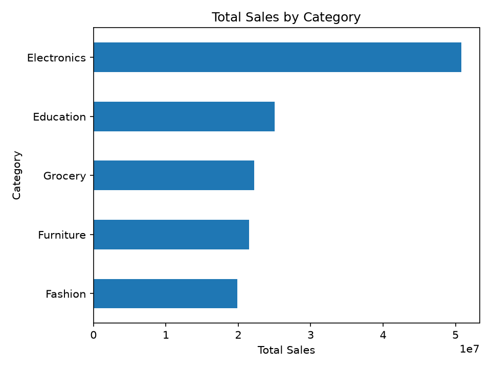
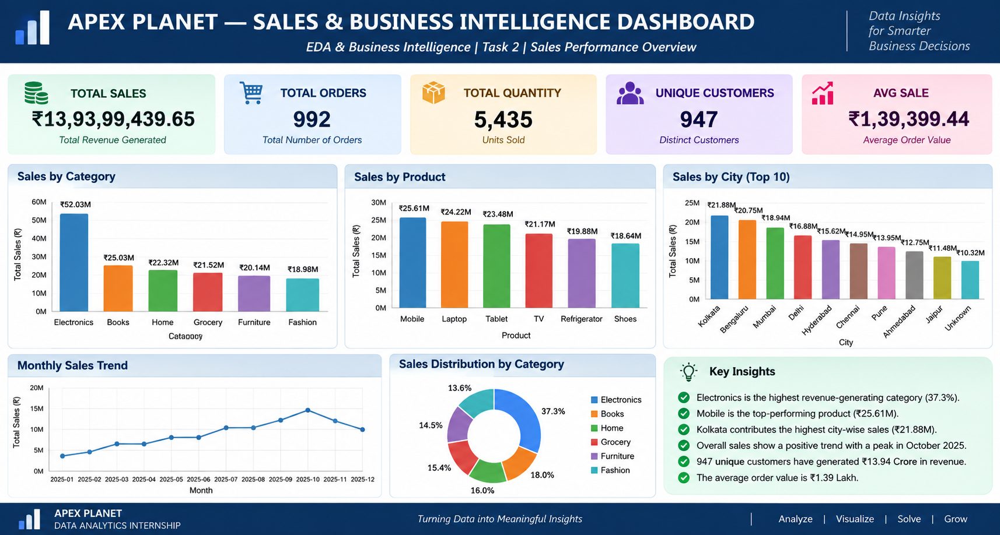
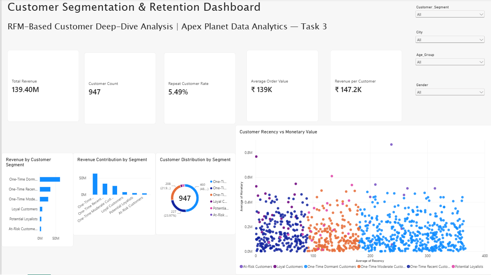
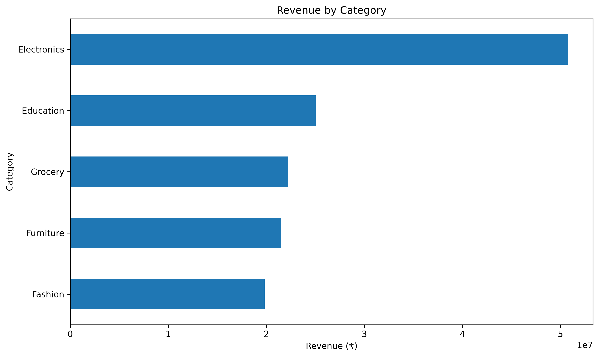

# Yogya Srivastava — Data Analyst Internship Portfolio

## Apex Planet Data Analytics Internship

> **From raw data to business decisions — a progression through data wrangling, exploratory analysis, business intelligence, customer analytics, statistical validation, and data storytelling.**

This repository is the **master portfolio** for my Apex Planet Data Analytics Internship. It brings together the work completed across four analytical tasks and presents the progression of my technical and analytical skills throughout the internship.

The detailed implementations remain available in their individual GitHub repositories; this portfolio provides a consolidated view of the projects, key findings, skills developed, and learning outcomes.

---

## 📊 Portfolio at a Glance

| Area | Result |
|---|---:|
| Transaction Records Analyzed | **1,000** |
| Unique Customers | **947** |
| Unique Order IDs | **992** |
| Total Revenue | **₹139.40M** |
| One-Time Customer Share | **94.51%** |
| Repeat Customer Rate | **5.49%** |
| Task 1 Validation | **12/12 Checks Passed** |
| SQL Business Questions | **7** |
| RFM Customer Segments | **6** |
| Customers in Statistical Test | **913** |

### Internship Progression

```text
Task 1 → Data Immersion & Wrangling
        ↓
Task 2 → EDA & Business Intelligence
        ↓
Task 3 → Deep-Dive Analysis & Interactive Dashboarding
        ↓
Task 4 → Data Storytelling & Statistical Validation
        ↓
Master Portfolio → Integrated Data Analytics Workflow
```

---

# 🚀 Project Journey

## Task 1 — Data Immersion & Wrangling

**Focus:** Building a reliable analytical foundation through inspection, cleaning, transformation, validation, feature engineering, reporting, and visualization.

### Key Work
- Dataset inspection and profiling
- Missing-value and duplicate analysis
- Data-type and categorical validation
- Outlier detection
- Data cleaning and transformation
- Feature engineering
- Automated validation
- Data dictionary creation
- Automated Excel reporting
- Business analysis and visualization

### Key Results
- **1,000 records** processed
- **33 missing cells** resolved
- **0 exact duplicate rows**
- **20 Age values** imputed and **13 City values** filled as `Unknown`
- **105 customer consistency records** flagged for review
- **19 potential sales outliers** identified
- **0 sales calculation errors**
- **8 derived analytical fields** created
- **12/12 validation checks passed — 100%**

Potential anomalies were flagged rather than blindly removed, preserving information for review.

**Technologies:** `Python` `Pandas` `NumPy` `Matplotlib` `OpenPyXL` `XlsxWriter` `Excel` `Git` `GitHub`

**[View Task 1 Repository](https://github.com/YogyaSrivastava134/Apex-Planet-Data-Analytics-Task-1)**

### Project Preview



---

## Task 2 — EDA & Business Intelligence

**Focus:** Turning cleaned data into business insights through exploratory analysis, SQL, multivariate analysis, and dashboard design.

### Key Work
- Descriptive and univariate analysis
- Categorical and sales-distribution analysis
- SQLite relational database creation
- Multi-table SQL business analysis
- Correlation and multivariate analysis
- Scatter plots, heatmaps, and pair plots
- Static Excel dashboard design

### Seven Business Questions Answered
1. Which products generate the highest total sales?
2. Which product categories perform best?
3. Which cities generate the highest sales?
4. What is the monthly sales trend?
5. How do customer demographics affect sales performance?
6. How many high-value transactions exceed ₹400,000?
7. Which products perform best within each city?

### Key Findings
- **Electronics:** approximately **₹50.78M**, or **36.43%** of total sales
- **Laptop:** highest product revenue at approximately **₹25.44M**
- **Patna:** highest row-level city sales at approximately **₹19.29M**
- **Bengaluru:** highest average transaction value at approximately **₹153,881.76**
- Male customers contributed approximately **51.98%** of total sales
- The **36–50 age group** generated approximately **₹45.56M** in sales

### Correlation Findings

| Relationship | Correlation |
|---|---:|
| Unit Price ↔ Total Sales | **0.6863** |
| Quantity ↔ Total Sales | **0.6466** |
| Age ↔ Quantity | -0.0277 |
| Quantity ↔ Unit Price | 0.0219 |
| Age ↔ Unit Price | -0.0120 |
| Age ↔ Total Sales | 0.0013 |

**Technologies:** `Python` `Pandas` `NumPy` `Matplotlib` `Seaborn` `SciPy` `SQLite` `SQL` `Excel` `Jupyter`

**[View Task 2 Repository](https://github.com/YogyaSrivastava134/Apex-Planet-Data-Analytics-Task-2)**

### Dashboard Preview



---

## Task 3 — Deep-Dive Analysis & Interactive Dashboarding

**Focus:** Understanding customer behavior through RFM analysis, customer segmentation, retention analysis, and interactive Power BI reporting.

### Key Work
- Transaction-grain validation
- Customer-level analytical preparation
- RFM analysis and scoring
- Customer segmentation
- Retention and customer-value analysis
- KPI development
- Power BI dashboard development
- DAX measures
- Interactive filtering and customer-level visual analysis

### Core KPIs
- Total Revenue
- Customer Count
- Repeat Customer Rate
- Average Order Value
- Revenue per Customer

### Customer Segments
- **Loyal Customers**
- **Potential Loyalists**
- **At-Risk Customers**
- **One-Time Recent Customers**
- **One-Time Moderate Customers**
- **One-Time Dormant Customers**

### Key Findings

| Segment | Customers | Revenue |
|---|---:|---:|
| One-Time Dormant | **460** | **₹63.70M** |
| One-Time Recent | **227** | **₹33.20M** |
| One-Time Moderate | **208** | **₹26.33M** |
| Loyal Customers | **22** | **₹7.54M** |
| Potential Loyalists | **20** | **₹4.75M** |
| At-Risk Customers | **10** | **₹3.89M** |

**895 customers** made one transaction, while **52 customers** were repeat customers, producing a **5.49% repeat customer rate**. This revealed a major opportunity for retention and reactivation.

The Power BI dashboard included KPI cards, segment revenue and distribution analysis, a recency-vs-monetary scatter plot, interactive slicers, customer-level tooltips, and DAX-based measures.

**Technologies:** `Python` `Pandas` `NumPy` `Matplotlib` `Seaborn` `SciPy` `Excel` `Power BI` `DAX` `Git` `GitHub`

**[View Task 3 Repository](https://github.com/YogyaSrivastava134/Apex-Planet-Data-Analytics-Task-3)**

### Power BI Dashboard Preview



---

## Task 4 — Data Storytelling & Statistical Validation

**Focus:** Transforming analytical findings into a stakeholder-ready business story and validating a business hypothesis statistically.

### Key Work
- Business storytelling
- Revenue and product analysis
- Customer retention analysis
- RFM segmentation
- Recency-vs-monetary analysis
- Hypothesis formulation and testing
- Confidence-interval and effect-size interpretation
- Business recommendations
- Stakeholder presentation development

### The Business Story

```text
Strong Revenue Foundation
        ↓
Customer Retention Gap
        ↓
RFM Customer Segmentation
        ↓
Targeted Customer Actions
        ↓
Statistical Validation
        ↓
Evidence-Based Business Recommendations
```

### Central Finding

**94.51% of customers made only one transaction**, making customer retention the clearest growth opportunity identified in the analysis.

### Statistical Hypothesis

**Business question:** Does average customer monetary value differ significantly between male and female customers?

A two-sided **Welch independent-samples t-test** was performed at the customer level so repeated transactions were not treated as independent observations. Customers with inconsistent gender values across transactions were excluded from this specific test.

### Statistical Results

| Metric | Result |
|---|---:|
| Customers Analyzed | **913** |
| Female Customers | **445** |
| Male Customers | **468** |
| Female Mean Customer Value | **₹138,779.51** |
| Male Mean Customer Value | **₹143,641.79** |
| Mean Difference | **₹4,862.28** |
| Welch t-statistic | **0.620937** |
| p-value | **0.534797** |
| 95% Confidence Interval | **−₹10,505.79 to ₹20,230.35** |
| Cohen's d | **0.041116** |
| Decision | **Fail to Reject Hâ‚€** |

Because **p = 0.534797 > 0.05**, there was insufficient evidence to reject the null hypothesis. The confidence interval included zero and the effect size was very small.

> **Gender alone should not be treated as a primary evidence-based driver of customer monetary value in this dataset.**

### Recommended Actions
1. **Reactivate dormant customers**
2. **Convert one-time customers into repeat buyers**
3. **Protect loyal customers**
4. **Recover high-value at-risk customers**
5. **Measure retention continuously**
6. **Avoid unsupported demographic assumptions**

**Technologies:** `Python` `Pandas` `NumPy` `SciPy` `Matplotlib` `Seaborn` `OpenPyXL` `Python-PPTX` `Excel` `PowerPoint` `Git` `GitHub`

**[View Task 4 Repository](https://github.com/YogyaSrivastava134/Apex-Planet-Data-Analytics-Task-4)**

### Analysis Preview



---

# 📈 Key Business Insights Across the Internship

1. **Strong revenue foundation:** approximately **₹139.40M** in total revenue.
2. **Electronics leads the category mix:** **36.43%** of total revenue.
3. **Retention is the major opportunity:** **94.51%** of customers made only one transaction.
4. **Dormant customers form a large reactivation pool:** **460** One-Time Dormant customers.
5. **Small segments can be highly valuable:** Loyal and At-Risk customers contain disproportionately valuable customers.
6. **Behavioral segmentation is actionable:** RFM supports targeted reactivation, conversion, nurturing, protection, and recovery strategies.
7. **Statistical evidence matters:** the gender hypothesis test did not provide sufficient evidence of a meaningful difference in customer monetary value.

---

# 🛠️ Technical Skills Demonstrated

### Data Analytics
Data inspection, profiling, cleaning, missing-value treatment, duplicate detection, validation, outlier detection, feature engineering, descriptive statistics, and EDA.

### Business Intelligence
KPI development, business-question formulation, dashboard design, interactive reporting, Power BI, DAX, and Excel dashboards.

### SQL & Data Modeling
SQLite, relational database design, multi-table JOINs, aggregation, filtering, GROUP BY, HAVING, sorting, and date-based analysis.

### Customer Analytics
RFM analysis, customer segmentation, recency, frequency, monetary analysis, retention analysis, and customer-value analysis.

### Statistics
Hypothesis formulation, Welch's t-test, p-value interpretation, confidence intervals, effect-size interpretation, and statistical decision-making.

### Visualization & Storytelling
Matplotlib, Seaborn, business charts, multivariate visualizations, KPI presentation, stakeholder storytelling, and presentation design.

### Development
Python virtual environments, reproducible scripts, requirements management, Git, GitHub, and project documentation.

---

# 🧠 Tools & Technologies

`Python` `Pandas` `NumPy` `SciPy` `Matplotlib` `Seaborn` `OpenPyXL` `XlsxWriter` `SQLite` `SQL` `Jupyter` `Microsoft Excel` `Power BI` `DAX` `Microsoft PowerPoint` `Git` `GitHub`

---

# 📚 Key Learning Outcomes

### Data Quality Comes First
Reliable analysis begins with systematic inspection, validation, and understanding of the underlying data.

### Analysis Should Answer Business Questions
Technical analysis becomes more valuable when it is connected to concrete business questions and decisions.

### Different Problems Require Different Methods
The internship provided hands-on experience with data wrangling, EDA, SQL, correlation analysis, customer segmentation, Power BI, statistical testing, and data storytelling.

### Visualizations Need Context
A chart can reveal a pattern, but the analyst must understand the underlying data before interpreting it. The January 2026 revenue observation, for example, was only a partial-period observation and should not be interpreted as a genuine business collapse.

### Statistical Significance Matters
A visible difference between groups does not automatically mean that the difference is statistically meaningful.

### Customer Behavior Can Drive Better Decisions
RFM segmentation demonstrated how behavioral data can be transformed into targeted customer strategies.

### Good Analytics Ends With Action
The objective is not simply to produce charts or statistics, but to translate evidence into clear and defensible business recommendations.

---

# 🔗 Project Repositories

| Task | Project | Repository |
|---|---|---|
| Task 1 | Data Immersion & Wrangling | [View Repository](https://github.com/YogyaSrivastava134/Apex-Planet-Data-Analytics-Task-1) |
| Task 2 | EDA & Business Intelligence | [View Repository](https://github.com/YogyaSrivastava134/Apex-Planet-Data-Analytics-Task-2) |
| Task 3 | Deep-Dive Analysis & Interactive Dashboarding | [View Repository](https://github.com/YogyaSrivastava134/Apex-Planet-Data-Analytics-Task-3) |
| Task 4 | Data Storytelling & Statistical Validation | [View Repository](https://github.com/YogyaSrivastava134/Apex-Planet-Data-Analytics-Task-4) |

---

# 📁 Portfolio Structure

```text
Yogya-Srivastava-Data-Analyst-Internship-Portfolio/
│
├── README.md
├── .gitignore
├── assets/
│   ├── task1-preview.png
│   ├── task2-dashboard.png
│   ├── task3-dashboard.png
│   └── task4-preview.png
├── presentation/
│   └── Apex_Planet_Master_Portfolio_Presentation.pptx
└── reflections/
    └── learning-reflections.md
```

# 🎯 Final Takeaway

The Apex Planet Data Analytics Internship provided a practical progression through the complete data analytics lifecycle:

> **Prepare → Explore → Analyze → Segment → Validate → Communicate → Recommend**

The most important lesson is that effective data analytics is not only about technical execution. It combines **data quality, analytical reasoning, statistical evidence, visualization, business context, and communication** to support better decisions.

> **The next growth opportunity is not simply selling more — it is getting more customers to come back.**

---

# 👤 Author

## Yogya Srivastava

**Data Analytics Intern | Aspiring Data Analyst**

A project-focused analytics portfolio demonstrating practical experience in Python, SQL, Excel, Power BI, statistics, data visualization, and business intelligence.

---

## ⭐ Portfolio Status

**Apex Planet Data Analytics Internship — Tasks 5 / 5 Completed**

**Master Portfolio — Final Integration | Core Project Showcase Complete**

Final portfolio materials, including the master presentation and learning reflections, are included in this repository.
